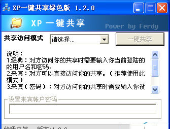

# XP一件共享软件

## XP一键共享工具是Windows平台早期所参与适配的局域网共享服务工具之一，具体就是要添加各路自定义的信息分享模式，尤其是任务逻辑框架，任务处置状态保护以及细节任务组别调整等，通常都存在本地使用以及外部访问模式等层面的大规模数据循环同步，必要的时候添加密码辅助信息。

1、经典：对方拜候你的同享时需求输出你以后上号的用户名和密码。

2、宾客：对方可以直接拜候你的同享。（举荐运用此形式）

3、宾客（密码）：对方拜候你的同享时需求输出你设置的密码。请鄙人方设置密码！

4、封闭同享：使你的电脑不克不及被局域网其它用户拜候！

## 注重事项

1、必需是局域网用户。

2、不需求设置小型家庭或办公收集。

3、运用的是任务组而不是域。

## 下载地址：

链接：https://pan.baidu.com/s/1JmtV_RziUgTLnJsu4IqyFg?pwd=y1bf 
提取码：y1bf