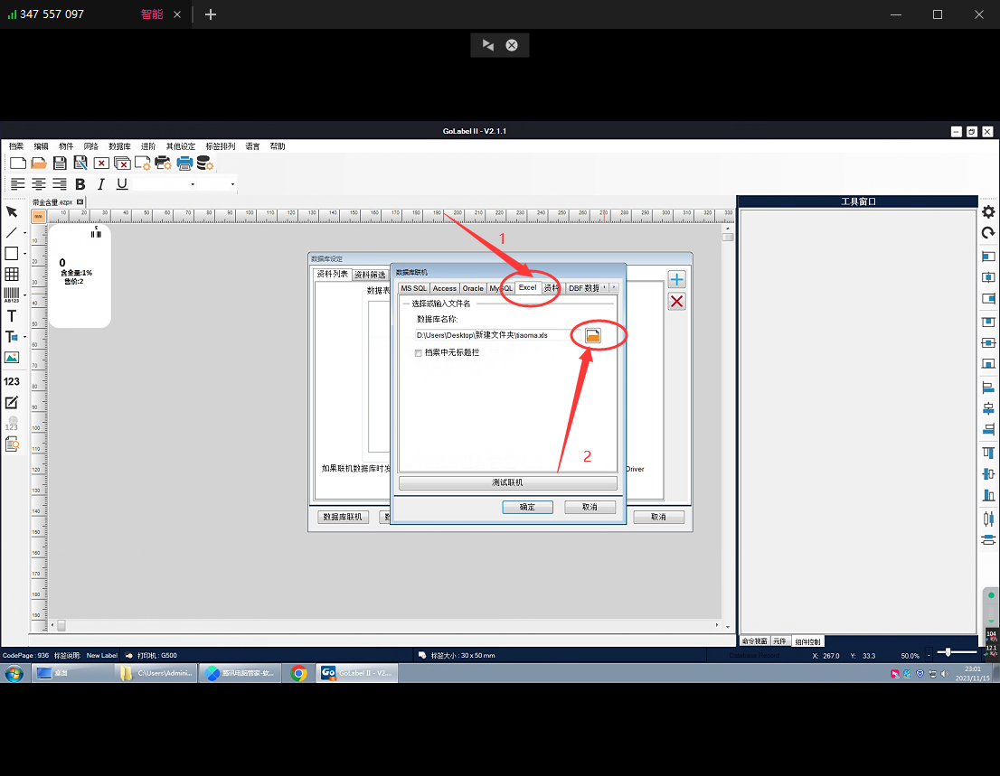

## GoLabel2.1 打印机标签教程

### 打开标签软件

### 选择模版

### 连接数据库

### 导入数据库

### 选择标签表格

### 选择

###  文档

### 确定

### 9. 模板对应相同的数据表格
    模板选择不对，数据导入模版会乱码。下面有做好的模板和安装吧

链接：https://pan.baidu.com/s/1hOI3BGYsv1takR_sXsbN9Q?pwd=i9da 
提取码：i9da
